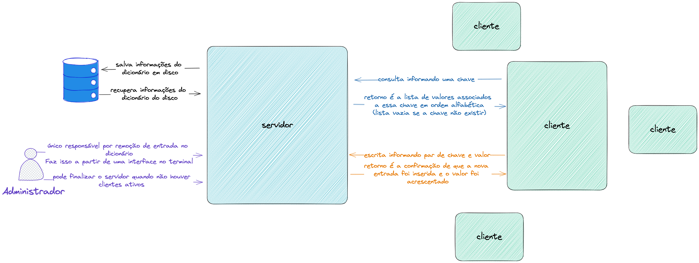

# Laboratório 2

#### Aplicação Cliente/Servidor Básica

```
Sistemas Distribuídos (ICP-367 e MAB-733)
Prof. Silvana Rossetto
Instituto de Computação/UFRJ 
```
# Descrição da tarefa
### Introdução

O objetivo deste Laboratório é desenvolver uma aplicação distribuída para aplicar os conceitos estudados sobre arquitetura de software e arquitetura de sistema; servidores
multiplexados e concorrentes; e seguir praticando com a programação usando sockets.
A aplicação que vamos desenvolver será um **dicionário remoto** que poderá ser
consultado e alterado. As chaves e valores do dicionário serão strings. O dicionário
deverá ser armazenado em disco para ser restaurado em uma execução futura.
- Para a **consulta**, o usuário informará uma **chave** e receberá como resposta a **lista de valores** associados a essa chave, em ordem alfabética (lista vazia caso a entrada não exista).
- Para a **escrita**, o usário informará um par **chave e valor** e receberá como resposta a confirmação que a nova entrada foi inserida, ou que o novo valor foi acrescentado
em uma entrada existente.
- A **remoção** de uma entrada no dicionário somente poderá ser feita pelo **administrador**
do dicionário.

Para meu entendimento da resolução do trabalho, fiz o seguinte desenho, a partir da descrição do laboratório:



## Atividade 1

**Objetivo**: Projetar a arquitetura de software da solução. A arquitetura de software
deverá conter, no mínimo, três componentes distintos: (i) acesso e persistência de dados;
(ii) processamento das requisições; e (iii) interface com o usuário.

**Roteiro**: 
1. Escolha o **estilo arquitetural** para servir de base para o desenho da arquitetura de
software.
2. Descreva os **componentes**, com suas funcionalidades (providas e usadas) e modo de conexão entre eles.

## Resolução da Atividade 1
**A resolução se encontra abaixo, mas também pode ser vista [neste arquivo](activity_1.md).**

### Arquitetura de Software

A partir da descrição da atividade e da [imagem](assets/draw-remote-dictionary.png) que fiz com base nas informações dispostas, foi possível seguir com o desenvolvimento da tarefa.  
Dado o meu entendimento do problema e o conteúdo da disciplina, a minha escolha arquitetural para resolução deste trabalho foi **em camadas**, conforme é possível visualizar na figura abaixo:  


Essa escolha foi muito baseada em como entendi o fluxo e como me parecia ser uma boa implementação, em que uma camada depende da outra para garantia de execução com sucesso. No fluxo de execução, do ponto de vista da pessoa usuária, a camada 3 é a primeira a ser chamada e chama a camada 2 que chama a camada 1. A descrição das camadas, em contraponto, foi feita da camada 1 para a camada 3.  

### Descrição das Camadas

#### Camada 1 - Acesso e Persistência
Camada responsável por: 
- Carregar o dicionário ao início do funcionamento;
- Atualizar e expor os dados durante o fluxo de execução e
- Armazenar o dicionário ao final da execução, para que as informações não se percam.

Dessa forma, visa garantir a persistência dos dados.
Esta camada é utilizado pela camada 2.

#### Camada 2 - Processamento das Requisições
Camada responsável pela garantia de execução das ações pedidas pela camada 3 da seguinte forma:
- Expõe os dados requisitados pela camada 3, fazendo uso da camada 1;
- Atualiza os dados a partir da requisição da camada 3, fazendo uso da camada 1;

Esta camada também possibilita interação com administrador, de forma a permitir a remoção de dados, persistidos a partir da camada 1, e a finalização do servidor, caso não haja clientes ativos.

#### Camada 3 - Interface com o Usuário

Camada responsável pela comunicação com o usuário, permitindo as seguintes ações:
- Escrita informando par de chave e valor. Essa requisição será feita à camada 2, que é responsável pelo retorno da confirmação de que a nova entrada foi inserida e o valor foi acrescentado ou, em caso de chave já existente, que o valor foi acrescentado. 
- Consulta informando uma chave. Essa requisição será feita à camada 2, que é responsável pelo retorno da lista de valores associados a essa chave em ordem alfabética (lista vazia se a chave não existir).  
Em ambas as ações, a camada 2, por sua vez irá fazer uso da camada 1 para que isso seja possível de forma segura e persistente, conforme descrito acima.

## Atividade 2

**Objetivo**: Instanciar a arquitetura de software da aplicação (definida na Atividade 1)
para uma **arquitetura de sistema cliente/servidor** de dois níveis, com um servidor e um cliente. O lado servidor abrigará o dicionário remoto, enquanto o lado cliente ficará responsável pela interface com o usuário.

**Roteiro**:
1. Defina quais componentes ficarão do lado do **cliente**.
2. Defina quais componentes ficarão do lado do **servidor**.
3. Defina o **conteúdo** e a **ordem** das mensagens que serão trocadas entre cliente e servidor, e quais **ações** cada lado deverá tomar quando receber uma mensagem.  
*Essa comunicação ficará responsável por fazer a “cola” entre os componentes instanciados em máquinas distintas.*

## Resolução da Atividade 2 
**A resolução encontra-se abaixo, mas também pode ser vista [neste arquivo](activity_2.md).**


### Arquitetura de Sistema

Foi escolhida uma arquitetura **centralizada**, pois o desenvolvimento da solução segue um modelo cliente/servidor, em que boa parte dos componentes de software estão implementados no lado do servidor e clientes remotos acessam suas funcionalidades, conforme a descrição da tarefa.

A [imagem](assets/draw-remote-dictionary.png) que fiz a partir da descrição e a [arquitetura de software](activity_1.md) feita na atividade 1 me auxiliaram a fazer esta arquitetura, que pode ser visualizada a partir da imagem a seguir:


A imagem é apenas um recurso visual para auxiliar no entendimento da disposição dos componentes na arquitetura de sistema, que segue a seguinte organização descrita a seguir.

#### Servidor
Possui os componentes 1 e 2 descritos como camadas 1 e 2 na [arquitetura de software](activity_1.md).  
É responsável, portanto, pelo acesso e persistência do dicionário e pelo processamento de requisições.

Para garantir o acesso e a persistência dos dados deve:
- Ter as informações salvas em disco carregadas no **início de sua execução**;
- Garantir a inserção de novos dados, a atualização de dados existentes e a exclusão de dados (apenas pelo administrador) **durante o fluxo de execução**;
- Garantir que os dados serão salvos ao **final da execução** para que fiquem disponíveis em uma nova execução.

Para garantir o processamento de requisições deve:
- Ser capaz de acessar os dados a partir do componente de acesso e persistência;
- Ser capaz de ser controlado por um administrador, para exclusão de dados e finalização da execução se não houver nenhum cliente conectado.
- Ser capaz de se comunicar com os clientes para que, a partir de conexões, consiga executar o desejado.
- Ser capaz de lidar com **múltiplos clientes**, garantindo a integridade do dicionário.

#### Cliente
Possui o componente 3 descrito como camada 3 na [arquitetura de software](activity_1.md).  
É responsável, portanto, pela interface com a pessoa usuária. 

Para garantir isso deve:
- Ser capaz de se comunicar com o servidor e isso se dará por meio de socket. Assim como no laboratório anterior, o cliente já saberá ***host*** e *porta* para se comunicar com o servidor e tentará se comunicar ao iniciar sua execução. 
    - Em caso de sucesso, será possível a interação para execução de tarefas usando o terminal.
    - Em caso de falha, uma mensagem será exibida: 
    > "Falha na conexão com o servidor. Não é possível fazer requisições ao dicionário no momento. 
    > Verifique se o servidor está disponível e tente novamente."
- Ser capaz de exibir uma interface de interação para execução de tarefas por parte da pessoa usuária. Isso se dará no terminal.

### Comunicação Cliente/Servidor
Essa comunicação se dará através de troca de mensagens, após o estabelecimento de uma conexão com sucesso entre cliente/servidor. 
As mensagens serão de tipos diferentes, conforme a descrição:
##### Inserção  
Cliente envia uma mensagem do tipo ***insert*** ao servidor com a **chave** e o **valor** que deseja inserir.  
Em caso de sucesso:
- Se o servidor verificar que o dicionário não possui a chave, responde ao cliente que a chave foi criada e o valor foi acrescentado, conforme abaixo:
> "A chave <chave> foi atualizada com o valor <valor>"  
- Se o servidor verificar que o dicionário já possui a chave, responde ao cliente que o valor foi acrescentado, conforme abaixo:  
> "A chave <chave> foi criada com o valor <valor>"

Em caso de falha, responde ao cliente:
> "Falha na execução da ação, verifique os argumentos"

Nesse caso, **chave** e **valor** são do tipo *string*.

##### Consulta  
Cliente envia uma mensagem do tipo ***get*** ao servidor com a chave que deseja consultar.  
Em caso de sucesso:
- Se o servidor verificar que o dicionário não possui a chave, responde ao cliente uma lista vazia:  
> "Resultado encontrado para a chave <chave>: []"
- Se o servidor verificar que o dicionário possui a chave, responde uma lista dos valores associados:  
> "Resultado encontrado para a chave <chave>: ["valor-1", "valor-2"]"  

Em caso de falha, responde ao cliente:
> "Falha na execução da ação, verifique os argumentos"

Nesse caso, **chave** é do tipo *string*.

## Atividade 3

**Objetivo**: Implementar e avaliar a aplicação distribuída proposta, seguindo as definições da Atividade 2.

**Roteiro**:
1. Implemente o código do lado cliente e do lado servidor;
2. Modularize e documente o código de forma concisa e clara;
3. Experimente a aplicação usando diferentes casos de teste.
4. Reporte as decisões tomadas em todas as Atividades no README do repositório
do código.  
O servidor deverá ser multiplexado: capaz de receber comandos básicos da entrada padrão (inclua comandos para permitir finalizar o servidor quando não houver clientes
ativos e remover uma entrada do dicionário). **Use a função *select*.**  
O servidor deverá ser concorrente: deverá tratar cada nova conexão de cliente como um novo fluxo de execução e atender as requisições desse cliente dentro do novo
fluxo de execução. **Crie threads ou processos filhos.**

## Resolução da Atividade 3

São os arquivos de código presentes nesse repositório. De forma que:
```
├── client.py           -> Classe do cliente, que implementa o componente de interface com a pessoa usuária e comunicação com o servidor
├── data.json           -> Representa o arquivo que auxilia na persistência do dicionário
├── server              -> Módulo que apresenta Classes essenciais para a execução do Servidor, dados seus componentes.
│   ├── __init__.py
│   ├── data.py         -> Classe de dados, que implementa o componente de acesso e persistência dos dados
│   └── processor.py    -> Classe de processamento, que implementa o componente de processamento das requisições
                           Comunica-se com a Classe de dados para viabilizar isso e retorna uma mensagem que será enviada ao cliente
└── server.py           -> Classe do servidor, que implementa a comunicação com o cliente, permite a comunicação de múltiplos clientes
                           e se apoia nas classes de dados e processamento para garantir o funcionamento da proposta
```
O arquivo Dockerfile foi criado apenas para auxiliar no desenvolvimento, dado problemas encontrados com as bibliotecas utilizadas (Threading/Multiprocessing) e o meu sistema operacional (macOS). Felizmente, consegui contornar usando a versão 3.7 do Python e comentando a linha 45 do arquivo `server.py`.

O código se encontra documentado.  

#### Disponibilize seu código
Disponibilize o código da sua aplicação em um ambiente de acesso remoto (GitHub ou GitLab) e use o formulário de entrega do laboratório para encaminhar as informações solicitadas.

# Como rodar

Para executar o exemplo, basta seguir as instruções a seguir.

Primeiro, suba o lado do servidor, executando o seguinte comando no terminal:

```
python3 server.py <porta>
```

O servidor possui interface via linha de comando para a pessoa administradora. Os comandos possíveis são:
```
get: coleta um valor a partir de uma chave
get_all: coleta todos os valores
delete: deleta um valor a partir de uma chave
fim: finaliza o servidor
```

Depois, suba o lado do cliente, executando o seguinte comando no terminal:

```
python3 client.py <host_do_servidor> <porta_do_servidor>
```

Aceita conexões concorrentes. Sinta-se livre para usufruir disso :)

Os comandos disponíveis para o cliente são:
```
get - Consultar os valores para uma palavra.
Ex.: Para consultar a palavra "teste", digite "get teste"
set - Adicionar UM único valor por vez para uma palavra. Se a palavra não existir, será criada no dicionário
Ex.: Para adicionar o valor "valor" para a palavra "teste", digite "set teste valor"
"help" - exibe esta mensagem novamente
"fim" - encerrar o programa
```

Digite **fim** como entrada para o cliente para encerrar a conexão com o servidor.

Digite **fim** como entrada para o servidor para desligar.

