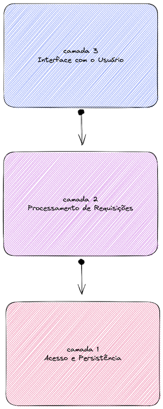

# Arquitetura de Software

A partir da descrição da atividade e da [imagem](assets/draw-remote-dictionary.png) que fiz com base nas informações dispostas, foi possível seguir com o desenvolvimento da tarefa.  
Dado o meu entendimento do problema e o conteúdo da disciplina, a minha escolha arquitetural para resolução deste trabalho foi **em camadas**, conforme é possível visualizar na figura abaixo:  

Essa escolha foi muito baseada em como entendi o fluxo e como me parecia ser uma boa implementação, em que uma camada depende da outra para garantia de execução com sucesso. No fluxo de execução, do ponto de vista da pessoa usuária, a camada 3 é a primeira a ser chamada e chama a camada 2 que chama a camada 1. A descrição das camadas, em contraponto, foi feita da camada 1 para a camada 3.  

## Descrição das Camadas

### Camada 1 - Acesso e Persistência
Camada responsável por: 
- Carregar o dicionário ao início do funcionamento;
- Atualizar e expor os dados durante o fluxo de execução e
- Armazenar o dicionário ao final da execução, para que as informações não se percam.

Dessa forma, visa garantir a persistência dos dados.
Esta camada é utilizado pela camada 2.

### Camada 2 - Processamento das Requisições
Camada responsável pela garantia de execução das ações pedidas pela camada 3 da seguinte forma:
- Expõe os dados requisitados pela camada 3, fazendo uso da camada 1;
- Atualiza os dados a partir da requisição da camada 3, fazendo uso da camada 1;

Esta camada também possibilita interação com administrador, de forma a permitir a remoção de dados, persistidos a partir da camada 1, e a finalização do servidor, caso não haja clientes ativos.

### Camada 3 - Interface com o Usuário

Camada responsável pela comunicação com o usuário, permitindo as seguintes ações:
- Escrita informando par de chave e valor. Essa requisição será feita à camada 2, que é responsável pelo retorno da confirmação de que a nova entrada foi inserida e o valor foi acrescentado ou, em caso de chave já existente, que o valor foi acrescentado. 
- Consulta informando uma chave. Essa requisição será feita à camada 2, que é responsável pelo retorno da lista de valores associados a essa chave em ordem alfabética (lista vazia se a chave não existir).  
Em ambas as ações, a camada 2, por sua vez irá fazer uso da camada 1 para que isso seja possível de forma segura e persistente, conforme descrito acima.