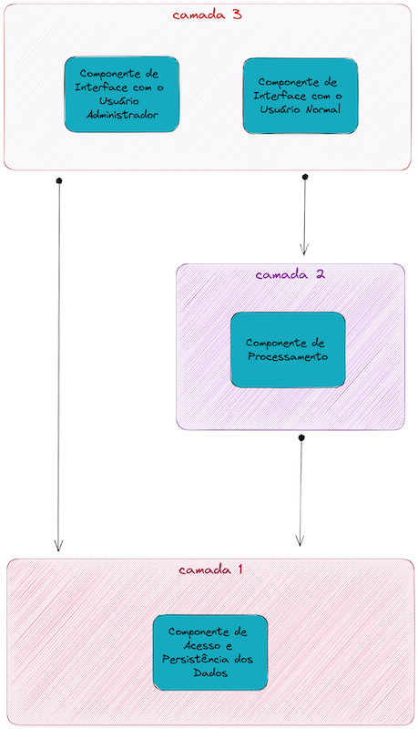

# Arquitetura de Software

A partir da descrição da atividade e da [imagem](assets/draw-remote-dictionary.png) que fiz com base nas informações dispostas, foi possível seguir com o desenvolvimento da tarefa.  
Dado o meu entendimento do problema e o conteúdo da disciplina, a minha escolha arquitetural para resolução deste trabalho foi **em camadas**, conforme é possível visualizar na figura abaixo:  

Essa escolha foi muito baseada em como entendi o fluxo e como me parecia ser uma boa implementação, em que uma camada só pode conversar com suas camadas vizinhas e uma depende da outra para garantia de execução com sucesso. No fluxo de execução, do ponto de vista da pessoa usuária, a camada 3 é a primeira a ser chamada.  

## Descrição das Camadas

### Camada 3 - Interface com o Usuário

Camada responsável pela comunicação com o usuário, que possui dois componentes:
- **Componente de interface com o usuário administrador (COMPONENTE 3)**  
Este componente possui as seguintes funcionalidades:
    - Permitir desligar o sistema de armazenamento e processamento.
    - Permitir acesso ao dicionário para as seguintes operações:
        - leitura de todas as chaves
        - leitura de uma única chave
        - remoção de chave no dicionário, sendo o único componente capaz de executar isso.  
    
    Para tais operações, precisa ser capaz de se comunicar com a camada 1, de dados.  
    É importante ser disponível APENAS para usuário administrador. Isso é possível a partir de um comando de remoção, que precisa da chave a ser removida.
- **Componente de interface com o usuário normal (COMPONENTE 4)**  
Este componente possui as seguintes funcionalidades:
    - Permitir a escrita ou a consulta de informações em um dicionário, a partir da escolha da operação:
        - Se a operação escolhida for de escrita, a pessoa usuária deve informar um par de chave e valor. Isso deverá ser passado à camada 2, que é responsável pelo processamento da informação recebida e pelo retorno da execução.
        - Se a operação escolhida for de consulta, a pessoa usuária deve informar uma chave. Isso deverá ser passado à camada 2, que é responsável pelo processamento da informação recebida e pelo retorno da execução.
    - Esse componente também expõe para o usuário o resultado da operação que foi processada pela camada 2 
    - Permitir desligar o componente.
feita à camada 2, que é responsável pelo retorno da lista de valores associados a essa chave em ordem alfabética (lista vazia se a chave não existir).  
Em ambas as ações, a camada 2, por sua vez irá fazer uso da camada 1 para que isso seja possível de forma segura e persistente, conforme descrito acima.

### Camada 2 - Processamento das Requisições
Camada responsável pela garantia de execução das ações pedidas pela camada 3 fazendo uso de um componente de **processamento de requisições (COMPONENTE 2)**. Esse componente é responsável por:
- Interpretar os dados que foram passados pela camada 3, para entender o tipo de operação a ser executada;
- A partir das informações recebidas, comunica-se com a camada 1 para que a operação desejada seja executada no dicionário. 
- É capaz de processar o retorno da camada 1 e retorna isso para a camada 3.

### Camada 1 - Acesso e Persistência
Camada composta pelo componente de **acesso e persistência (COMPONENTE 1)**, que é responsável por: 
- Carregar o dicionário ao início do funcionamento;
- Atualizar e expor os dados durante o fluxo de execução e
- Armazenar o dicionário ao final da execução, para que as informações não se percam.

Dessa forma, visa garantir a persistência dos dados.
Esta camada é utilizada pela camada 2, mas também pode ser chamada diretamente pela camada 3.