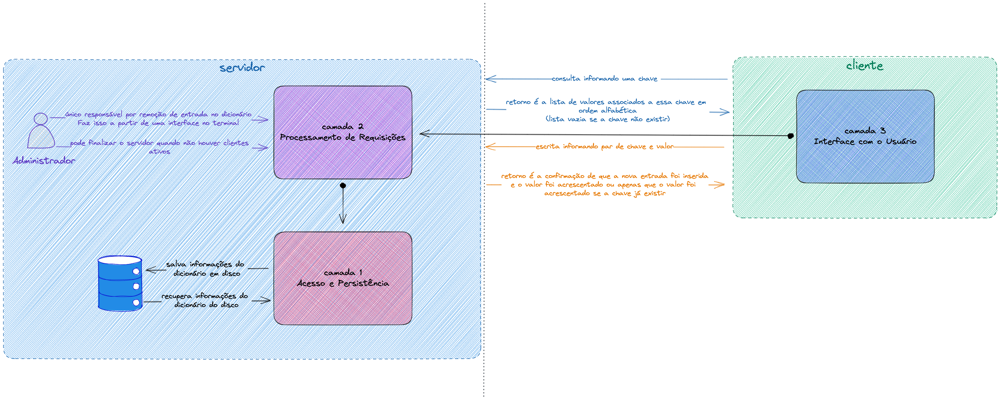

# Arquitetura de Sistema

Foi escolhida uma arquitetura **centralizada**, pois o desenvolvimento da solução segue um modelo **cliente/servidor**, em que boa parte dos componentes de software estão implementados no lado do servidor e clientes remotos acessam suas funcionalidades, conforme a descrição da tarefa.

A [imagem](assets/draw-remote-dictionary.png) que fiz a partir da descrição e a [arquitetura de software](activity_1.md) feita na atividade 1 me auxiliaram a fazer esta arquitetura, que pode ser visualizada a partir da imagem a seguir:

A imagem é apenas um recurso visual para auxiliar no entendimento da disposição dos componentes na arquitetura de sistema, que segue a seguinte organização descrita a seguir.

### Servidor
Possui os componentes 1, 2 e 3 que compõem as camadas 1, 2 e 3, conforme descrito na [arquitetura de software](activity_1.md).  
É responsável, portanto, pelo acesso e persistência do dicionário, pelo processamento de requisições e pela interface com o usuário administrador.

Para garantir o acesso e a persistência dos dados deve:
- Ter as informações salvas em disco carregadas no **início de sua execução**;
- Garantir a inserção de novos dados, a atualização de dados existentes e a exclusão de dados (apenas pelo administrador) **durante o fluxo de execução**;
- Garantir que os dados serão salvos ao **final da execução** para que fiquem disponíveis em uma nova execução.

Para garantir o processamento de requisições deve:
- Ser capaz de acessar os dados a partir do componente de acesso e persistência;
- Ser capaz de se comunicar com os clientes para que, a partir de conexões, consiga executar o desejado.
- Ser capaz de retornar os resultados das operações executadas pelo componente de de acesso e persistência;
- Ser capaz de lidar com **múltiplos clientes**, garantindo a integridade do dicionário.

Para garantir a interface com o administrador deve:
- Ser capaz de exibir uma interface de interação para execução de tarefas por parte da pessoa usuária administradora. Isso se dará no terminal;
- Ser capaz de receber comandos, para exclusão de dados, consulta e enviar ao componente de acesso e persistência; 
- Ser capaz de receber comando para finalização da execução e finalizar quando todos os processos de todos os clientes tiverem terminado. Só finaliza se não houver nenhum cliente conectado;
- Ser capaz de acessar os dados a partir do componente de acesso e persistência.

### Cliente
Possui o componente 3 que compõe a camada 3, como descrito na [arquitetura de software](activity_1.md).  
É responsável, portanto, pela interface com a pessoa usuária normal. 

Para garantir isso deve:
- Ser capaz de exibir uma interface de interação para execução de tarefas por parte da pessoa usuária normal. Isso se dará no terminal;
- Ser capaz de receber comandos, de consulta e inserção e enviar ao componente de processamento;
- Ser capaz de receber comando para finalização da execução do cliente e finalizar o componente;
- Ser capaz de se comunicar com o servidor e isso se dará por meio de socket. O cliente saberá ***host*** e *porta* para se comunicar com o servidor no momento de chamada da execução do programa e tentará se comunicar ao iniciar sua execução. 
    - Em caso de sucesso, será possível a interação para execução de tarefas usando o terminal.
    - Em caso de falha, uma mensagem será exibida: 
    > "Falha na conexão com o servidor. Não é possível fazer requisições ao dicionário no momento. 
    > Verifique se o servidor está disponível e tente novamente."

## Comunicação Cliente/Servidor
Essa comunicação se dará através de troca de mensagens, após o estabelecimento de uma conexão com sucesso entre cliente/servidor. 
As mensagens são compostas por `comando` e `corpo` e isso varia conforme a descrição:
#### Inserção  
Cliente envia uma mensagem ao servidor com o `comando` ***set*** e o `corpo` sendo **chave** e o **valor** que deseja inserir.  
Em caso de sucesso:
- Se o servidor verificar que o dicionário não possui a chave, responde ao cliente que a chave foi criada e o valor foi acrescentado, conforme abaixo:
> "A chave <chave> foi atualizada com o valor <valor>"  
- Se o servidor verificar que o dicionário já possui a chave, responde ao cliente que o valor foi acrescentado, conforme abaixo:  
> "A chave <chave> foi criada com o valor <valor>"

Em caso de falha, responde ao cliente:
> "Falha na execução da ação, verifique os argumentos"

#### Consulta  
Cliente envia uma mensagem ao servidor com o `comando` ***get*** e o `corpo` sendo a **chave** que deseja consultar.  
Em caso de sucesso:
- Se o servidor verificar que o dicionário não possui a chave, responde ao cliente uma lista vazia:  
> "Resultado encontrado para a chave <chave>: []"
- Se o servidor verificar que o dicionário possui a chave, responde uma lista dos valores associados:  
> "Resultado encontrado para a chave <chave>: ["valor-1", "valor-2"]"  

Em caso de falha, responde ao cliente:
> "Falha na execução da ação, verifique os argumentos"

Se a mensagem recebida pelo servidor não tiver nenhum dos dois comandos esperados, há um retorno de erro:  
> "Falha na execução da ação, verifique os argumentos"

Em ambos os casos, `comando` e `corpo` são do tipo *string* e enviados convertidos para *byte*.